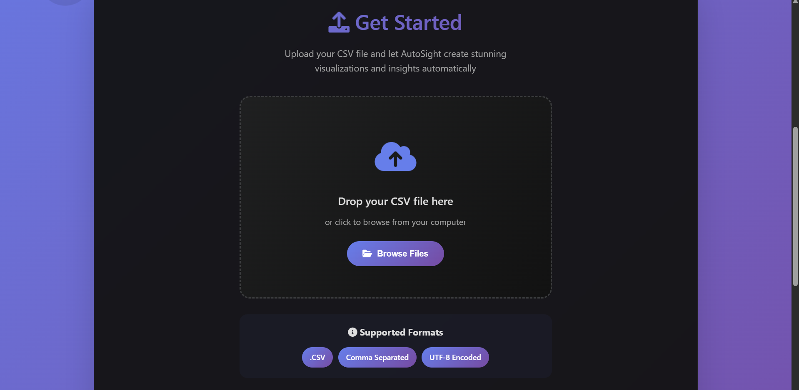
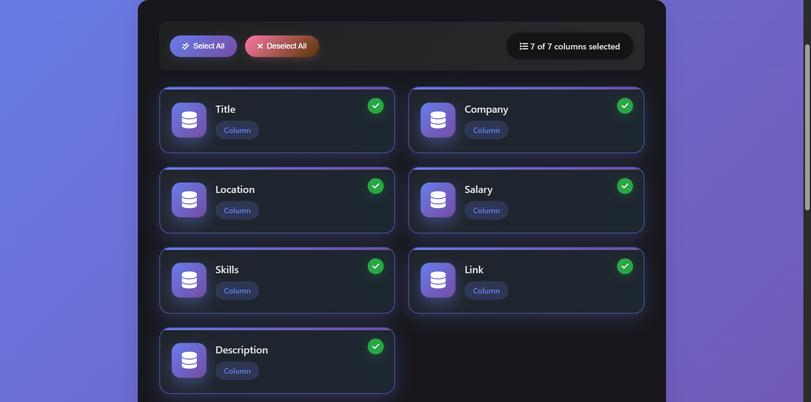
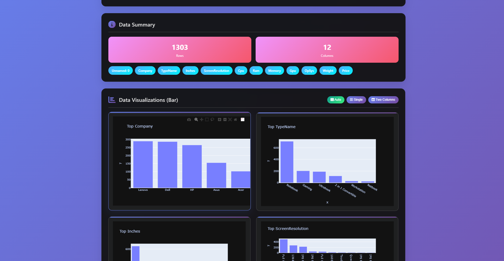

<div align="center">

# 📊 AutoSight
### *Transform CSV Files into Interactive Dashboards*


[](https://python.org)
[](https://fastapi.tiangolo.com/)
[](https://plotly.com/)
[](https://opensource.org/licenses/MIT)

<p align="center">
  <a href="#-features">Features</a> •
  <a href="#-quick-start">Quick Start</a> •
  <a href="#-demo">Demo</a> •
  <a href="#-tech-stack">Tech Stack</a> •
  <a href="#-roadmap">Roadmap</a> •
  <a href="#-contributing">Contributing</a>
</p>

---

</div>

## 🎯 What is AutoSight?

> **AutoSight** is a powerful yet lightweight web application that transforms your raw CSV data into beautiful, interactive dashboards. With just a few clicks, you can visualize your data, clean it intelligently, and generate comprehensive reports — all while keeping your data completely local and secure.

<div align="center">

### 🚀 **From Raw Data to Insights in Minutes**

```
CSV Upload → Data Cleaning → Visualization → Dashboard → Export
    ⏱️ 30s      ⏱️ 10s         ⏱️ 5s        ⏱️ 2s      ⏱️ 5s
```

</div>

---

## ✨ Features

<table>
<tr>
<td width="50%">

### 📊 **Visualization Engine**
- 📈 **Multiple Chart Types**: Bar, Pie, Line, Scatter plots
- 🎨 **Interactive Plotly Charts**: Zoom, pan, hover details
- 🔍 **Column Selector**: Focus on specific data dimensions
- 📱 **Responsive Design**: Works on all devices

</td>
<td width="50%">

### 🧼 **Smart Data Cleaning**
- ⚡ **Quick Clean**: Remove nulls, duplicates instantly
- 🔬 **Thorough Clean**: Advanced outlier detection
- 💡 **Smart Suggestions**: AI-powered cleaning recommendations
- 🎯 **Custom Filters**: Low-code data filtering interface

</td>
</tr>
<tr>
<td width="50%">

### 📊 **Advanced Analytics**
- 🧮 **Correlation Matrix**: Beautiful heatmap visualizations
- 📋 **Pandas Profiling**: Comprehensive data reports
- 📊 **Statistical Insights**: Mean, median, distribution analysis
- 🔗 **Relationship Discovery**: Find hidden data patterns

</td>
<td width="50%">

### 🔒 **Privacy & Security**
- 🏠 **100% Local Processing**: Your data never leaves your machine
- 🚫 **No Cloud Upload**: Complete data privacy
- ⬇️ **Export Options**: Download cleaned/filtered data
- 🗑️ **Auto Cleanup**: Temporary files automatically removed

</td>
</tr>
</table>

---

## 🎬 Demo Preview

<div align="center">

### 📸 **See AutoSight in Action**

| 📁 **Upload CSV** | 🎯 **Select Columns** | 📊 **Interactive Dashboard** |
|:-----------------:|:---------------------:|:----------------------------:|
|  |  |  |
| *Drag & drop your CSV file* | *Choose relevant columns* | *Explore your data visually* |

</div>

---

## 🚀 Quick Start

<details>
<summary><b>🔧 Installation Guide</b></summary>

### Prerequisites
- Python 3.10 or higher
- Git

### Step-by-Step Setup

```bash
# 1️⃣ Clone the repository
git clone https://github.com/dhritikrishna/AutoSight.git
cd AutoSight

# 2️⃣ Create virtual environment (recommended)
python -m venv venv

# 3️⃣ Activate virtual environment
# On Windows:
venv\Scripts\activate
# On macOS/Linux:
source venv/bin/activate

# 4️⃣ Install dependencies
pip install -r requirements.txt

# 5️⃣ Launch the application
uvicorn main:app --reload